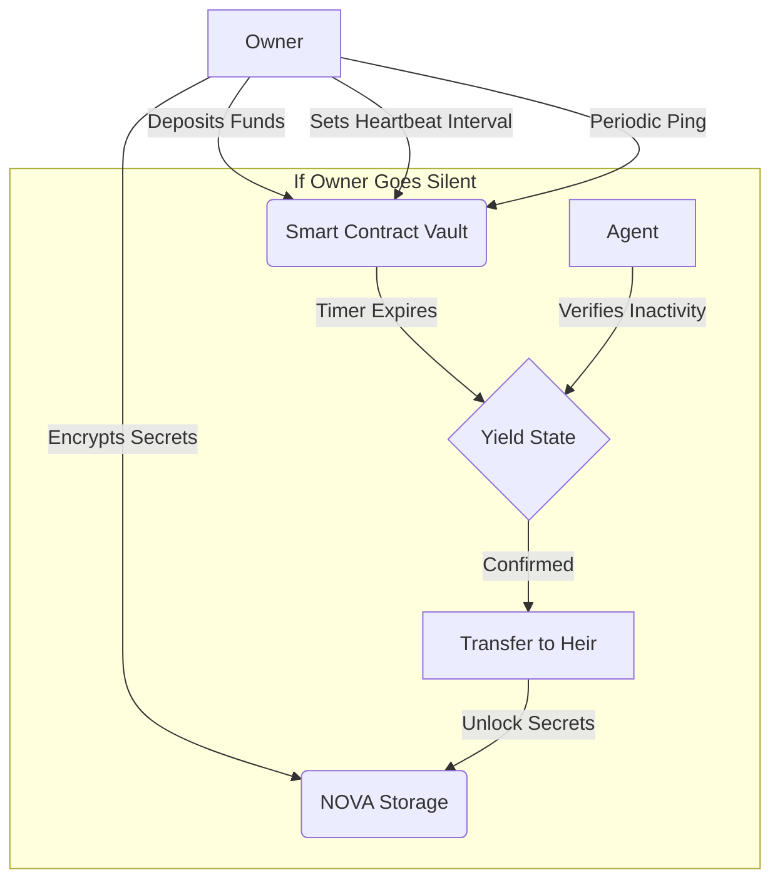

# KeepAlive Protocol

**Trustless Digital Inheritance on NEAR Protocol**

KeepAlive is a decentralized protocol that ensures your crypto assets are securely transferred to a designated beneficiary if you ever become inactive. It acts as an on-chain automated inheritance system, protecting your digital legacy without intermediaries, custodians, or trust.


## Core Features

- **Automated Asset Transfer**: Funds locked in your vault are automatically transferred to your heir if you fail to send a heartbeat ping.
- **NOVA Integration**: Attach encrypted secrets (private keys, messages) to your vault. Secrets are encrypted client-side (AES-256-GCM) and stored on the NOVA decentralized storage network.
- **Zero-Knowledge Architecture**: The server and protocol never see your unencrypted data. Only your beneficiary can decrypt the payload after the protocol triggers.
- **Yield/Resume Pattern**: If you miss a heartbeat, the contract enters a `YIELD` state. An off-chain agent verifies your status before finalizing the transfer, preventing accidental triggers.

## Architecture

### Inheritance Flow



### Tech Stack

- **Smart Contract**: NEAR Protocol (TypeScript / near-sdk-js)
- **Frontend**: Next.js 16, React 19, TailwindCSS v4, motion-primitives
- **Storage**: NOVA Decentralized Storage (IPFS-based)
- **Encryption**: Web Crypto API (AES-256-GCM)
- **Agent**: Node.js automated verification daemon

## Getting Started

### Prerequisites

- Node.js v18+
- NEAR Wallet

### Installation

1. **Clone the repository**
   ```bash
   git clone https://github.com/EfuzeGI/Sentinel-Project.git
   cd Sentinel-Project
   ```

2. **Frontend Setup**
   ```bash
   cd frontend
   npm install
   cp .env.example .env.local
   # Configure your .env.local with NEXT_PUBLIC_NOVA_API_KEY
   npm run dev
   ```

3. **Agent Setup (Optional)**
   The agent monitors vaults and triggers the yield/transfer process.
   ```bash
   cd agent
   npm install
   cp .env.example .env
   # Configure AGENT_PRIVATE_KEY and TELEGRAM_BOT_TOKEN
   node index.js
   ```

## Smart Contract

The core logic resides in `contract/src/contract.ts`. Key methods:

- `setup_vault({ beneficiary, interval })`: Initialize your vault.
- `ping()`: Reset your heartbeat timer.
- `deposit()`: Add funds to your vault.
- `withdraw()`: Retrieve funds (owner only).
- `get_status()`: meaningful state for UI.

## Telegram Bot

The **@keepalive_near_bot** provides notifications for:
- Heartbeat warnings (when time is running low)
- Transfer execution events
- Vault status updates

## License

MIT License. Open source and trustless.
